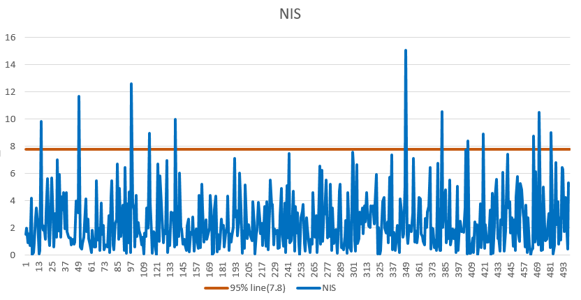

# Unscented Kalman Filter Project 
Self-Driving Car Engineer Nanodegree Program
---

## Description

It is a Sensor Fusion project in C++ to track a bicycle with measurement data from both RADAR and LIDAR sensors. The object is predicted with a Constant Turn Rate and Velocity magnitude model. An efficient Unscented Kalman Filter is implemented to address the non-linearity in the motion model.

## Dependencies

* cmake >= v3.5
* make >= v4.1
* gcc/g++ >= v5.4

## Basic Build Instructions

1. Clone this repo.
2. Make a build directory: `mkdir build && cd build`
3. Compile: `cmake .. && make`
4. Run it: `./UnscentedKF path/to/input.txt path/to/output.txt`. You can find
   some sample inputs in 'data/'.
    - eg. `./UnscentedKF ../data/obj_pose-laser-radar-synthetic-input.txt`

## Test Result

The following table summarizes root-mean-square error(RMSE) in position and velocity of both axises between the tracked states and the ground-truth reference. It shows a high accuracy prediction and tracking performance.

| Sample Name                                   | p_x (m)   | p_y (m)   | v_x (m/s) | v_y (m/s) |
|-----------------------------------------------|-----------|-----------|-----------|-----------|
| data/obj_pose-laser-radar-synthetic-input.txt | 0.0644685 | 0.0941484 | 0.289432  | 0.289684  |

Process noise standard deviation longitudinal acceleration is set `0.3` m/s^2.
Process noise standard deviation yaw acceleration is set `0.3` rad/s^2.
The chart below indicates a good fit of noise model as NIS is mostly below the 95% line.

